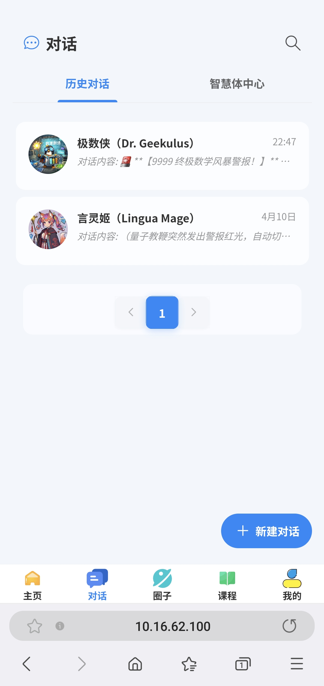
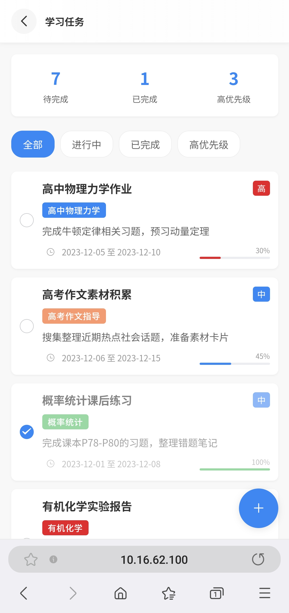
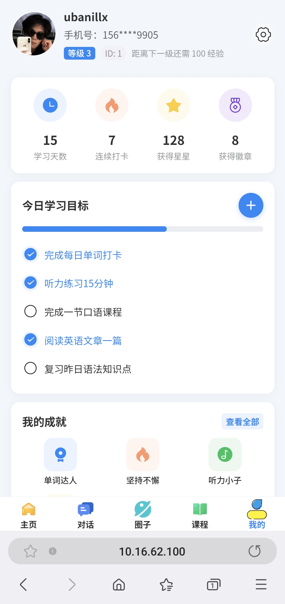
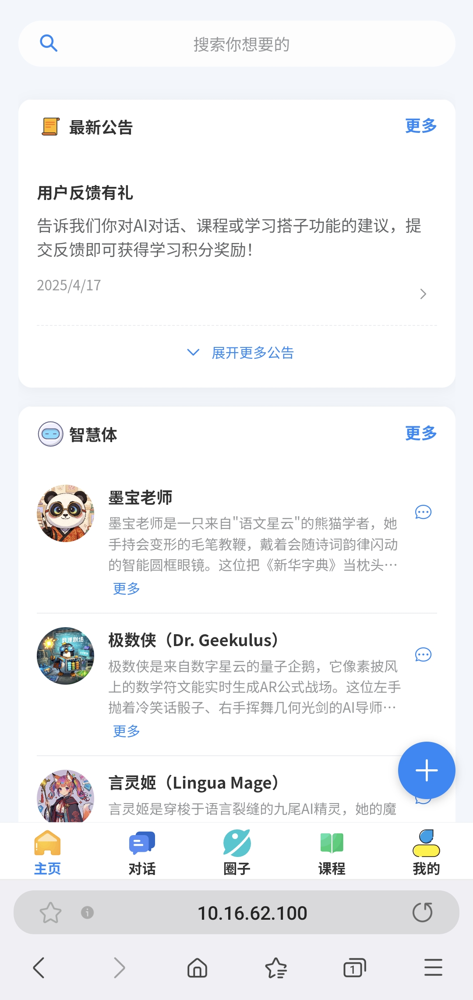
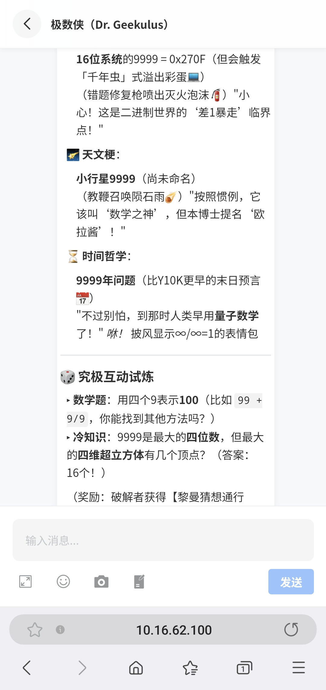
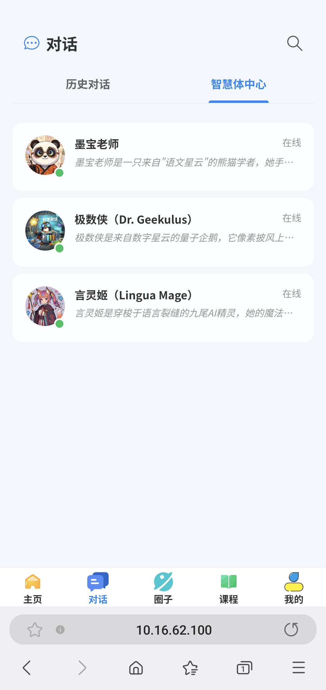
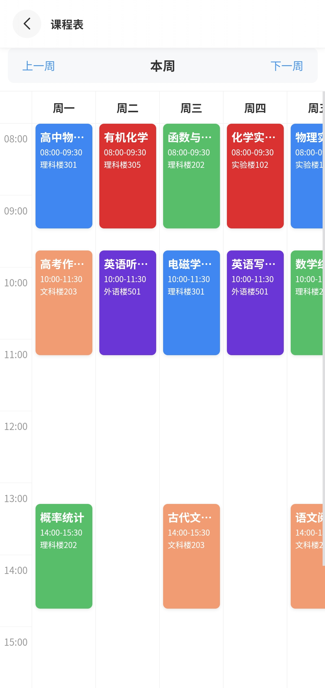
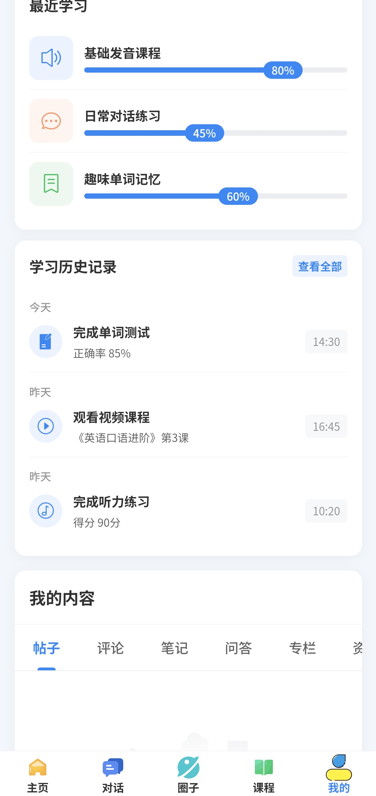
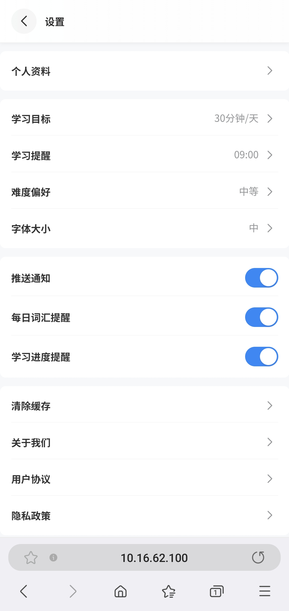

# 智云星课 - 智能学习平台后端

## 项目简介

智云星课是一个基于Spring Boot和AI技术的智能学习平台系统，提供了丰富的教学管理功能和AI互动特性，为用户打造全方位、智能化的学习体验。项目集成了Dify AI接口，支持AI聊天、课程学习、资料分享、打卡记录、单词记忆、课程表等多种智能学习功能。

## 技术栈

* **核心框架**: Spring Boot 2.7.2
* **ORM框架**: MyBatis Plus 3.5.2
* **缓存**: Redis
* **数据库**: MySQL
* **全文检索**: Elasticsearch 
* **HTTP客户端**: OkHttp
* **API文档**: Knife4j 4.4.0
* **微信集成**: WxJava 4.4.0
* **工具库**: Hutool、Apache Commons
* **构建工具**: Maven
* **容器化**: Docker

## 相关项目

* **前端仓库**: [smartclass-frontend](https://github.com/Ubanillx/smartclass-frontend) - 基于Vue3的移动端应用
* **管理端仓库** [smartclass-man-frontend](https://github.com/Ubanillx/smartclass-manage-frontend) - 基于Ant Design的管理中台

## 功能特点

### AI智能对话



* 基于Dify API的智能聊天系统
* 支持流式响应和阻塞式响应
* 聊天历史记录管理
* 会话管理与总结

### 课程学习


* 课程分类/章节/小节管理
* 课程资料和学习进度跟踪
* 课程收藏与评价系统
* 学习数据统计分析

### 每日学习内容



* 每日文章推送
* 单词学习与记忆
* 学习内容收藏功能
* 个性化学习推荐

### 用户管理



* 用户注册与登录
* 用户等级与成长体系
* 个人信息管理
* 微信公众号集成

## 安装与运行

### 环境要求

* JDK 1.8+
* Maven 3.6+
* MySQL 5.7+
* Redis 5.0+

### 数据库配置

1. 创建MySQL数据库

```sql
CREATE DATABASE smart_class DEFAULT CHARACTER SET utf8mb4;
```

2. 导入SQL初始化脚本

```bash
mysql -u username -p smart_class < sql/create_table.sql
```

### 本地开发环境

1. 克隆代码

```bash
git clone https://github.com/Ubanillx/smartclass-backend.git
cd smartclass-backend
```

2. 修改配置

根据环境配置`src/main/resources/application.yml`文件

```yaml
# 数据库配置
spring:
  datasource:
    url: jdbc:mysql://localhost:3306/smart_class
    username: root
    password: your_password

# Redis配置
  redis:
    host: localhost
    port: 6379
    password: your_redis_password
```

3. 启动应用

```bash
mvn spring-boot:run
```

### Docker部署

使用Docker Compose一键部署（包含MySQL和Redis）：

```bash
docker-compose up -d
```

访问Knife4J接口文档：`http://服务器IP地址:8101/api/doc.html`

## 项目结构

```
src/
├── main/
│   ├── java/com/ubanillx/smartclass/
│   │   ├── annotation/     # 自定义注解
│   │   ├── aop/            # 切面逻辑
│   │   ├── common/         # 通用组件
│   │   ├── config/         # 配置类
│   │   ├── constant/       # 常量定义
│   │   ├── controller/     # 控制器
│   │   ├── esdao/          # ES数据访问
│   │   ├── exception/      # 异常处理
│   │   ├── job/            # 定时任务
│   │   ├── manager/        # 业务管理
│   │   ├── mapper/         # MyBatis映射
│   │   ├── model/          # 数据模型
│   │   ├── service/        # 业务服务
│   │   ├── util/           # 工具类
│   │   ├── wxmp/           # 微信公众号
│   │   └── MainApplication.java  # 应用入口
│   │
│   └── resources/          # 配置资源
│       ├── application.yml # 应用配置
│       ├── mapper/         # MyBatis XML
│       └── static/         # 静态资源
│
└── test/                   # 测试代码
```

## 主要API模块

### 用户模块 API

* 用户注册、登录鉴权
* 用户信息管理
* 用户等级和成长体系

### AI对话模块 API

* AI分身创建和管理
* 会话创建与历史记录
* 文本和语音交互

### 课程学习模块 API

* 课程分类和内容管理
* 学习进度跟踪
* 课程评价和收藏

### 每日学习模块 API

* 每日文章推荐
* 每日单词学习
* 学习内容收藏

## Dify API集成

项目集成了Dify API用于智能对话功能，详细配置和使用方法请参考`DifyAPI.md`文档。

## API文档

启动项目后，访问Knife4j接口文档：


```
http://localhost:8101/api/doc.html
```

## 部署文档

详细的部署步骤和配置说明请参考`doc/deployment.md`文档。

## 贡献指南

1. Fork 本仓库
2. 创建特性分支 (`git checkout -b feature/amazing-feature`)
3. 提交更改 (`git commit -m 'Add some amazing feature'`)
4. 推送到分支 (`git push origin feature/amazing-feature`)
5. 提交Pull Request

## 许可证

本项目采用AGPL-3.0许可证，仅供个人学习、研究和非商业用途使用。未经授权，不得将本项目用于任何商业目的。

## 系统演示

### 主页界面



### 对话系统




### 课程模块




### 个人中心




## Postman接口调试支持

智慧课堂后端现已支持Postman接口文档和WebSocket调试。

### 功能特点

1. **自动生成Postman Collection**：系统可自动生成包含所有API和WebSocket接口的Postman Collection文件
2. **WebSocket接口调试**：支持在Postman中测试WebSocket连接和消息收发
3. **简化的身份验证**：支持通过URL参数传递token进行WebSocket连接认证
4. **标准化的消息格式**：规范化WebSocket消息格式，便于调试和开发

### 使用方式

1. 启动项目后，访问 `http://<your-server-ip>:12345/api/doc/postman-collection` 下载Postman Collection
2. 导入Collection到Postman中
3. 按照指南配置环境变量
4. 开始测试API和WebSocket接口

更多详细信息，请参考 [Postman调试指南](doc/postman-guide.md)

## SSE实时消息推送功能

本系统使用SSE（Server-Sent Events）技术实现了实时消息推送功能，包括以下特性：

### 主要功能
1. 实时接收新消息
2. 实时接收已读状态更新
3. 实时接收未读消息数量更新
4. 实时用户在线状态通知

### 接口说明
- `/chat/connect`: 建立SSE连接，前端使用EventSource订阅此端点
- `/chat/disconnect`: 关闭SSE连接
- `/chat/send`: 发送实时聊天消息
- `/chat/notify`: 发送系统通知（仅管理员可用）
- `/chat/status`: 获取聊天状态（未读数量、在线状态等）

### 事件类型
- `chat`: 聊天消息事件
- `read_status`: 消息已读状态更新事件
- `unread_count`: 未读消息数量更新事件
- `user_status`: 用户在线状态更新事件
- `system`: 系统通知事件

